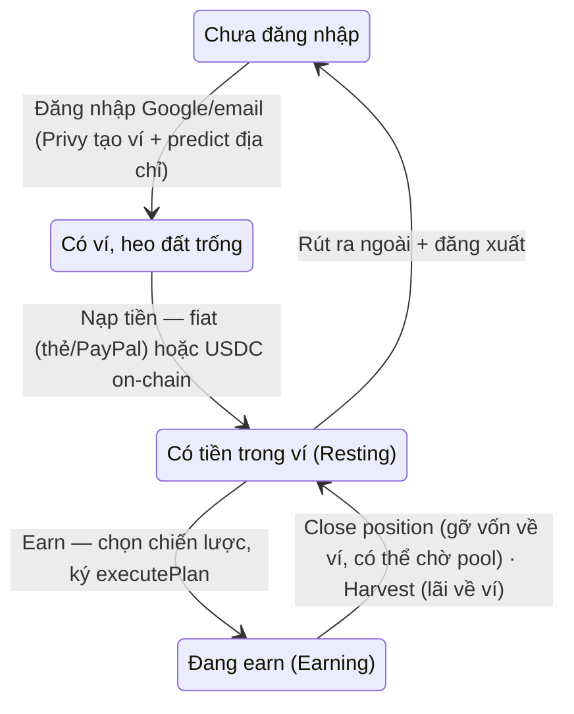
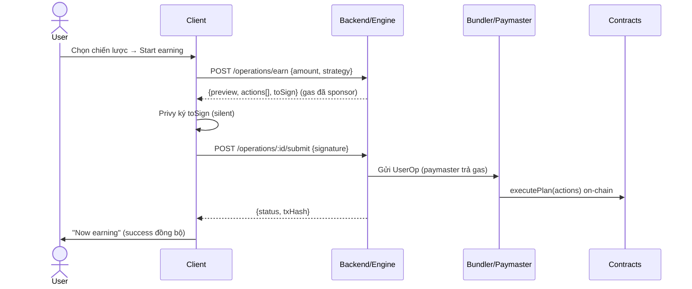

# CryptoPiggy — Product Flow

Blueprint UX cho web/mobile. Nguyên tắc xuyên suốt: **người dùng không cần biết gì về
crypto** — không seed phrase, không gas, không chọn chain/token, không popup hex.
Non-custodial tuyệt đối: mọi lệnh di chuyển tiền do chính ví user ký (`onlyOwner` trên
`SmartInvestmentAccount`).

> **API contract chuẩn ở [API.md](./API.md)** — đây là nguồn sự thật cho backend/engine.
> Kiến trúc + real-vs-sim ở [ARCHITECTURE.md](./ARCHITECTURE.md). File này chỉ mô tả **luồng
> UX**. Nếu có mâu thuẫn, API.md/ARCHITECTURE.md thắng.

## Quyết định

| Lớp | Lựa chọn |
|---|---|
| Đồng tiền | **USDC** (đô-la ổn định — không biến động giá). Ẩn hoàn toàn khái niệm chain/token khỏi user. |
| Ví | Privy embedded wallet (đăng nhập Google/email), 2-of-3 shares, non-custodial |
| Gas | EIP-7702 smart EOA + paymaster — user **không bao giờ cần ETH**; `msg.sender` vẫn là owner nên contract giữ nguyên |
| Nạp tiền | **Fiat (thẻ/PayPal qua cổng thứ ba → USDC)** hoặc gửi USDC vào địa chỉ heo đất |
| Frontend | Next.js + TS + wagmi/viem. **Một màn hình duy nhất + bottom sheets** (KHÔNG đa tab) |
| Engine | Backend trả các **operation** đã build sẵn `Action[]` + UserOp sponsor gas (xem API.md) |

## Mô hình tiền — HAI TÚI (quan trọng nhất)

Tiền của user chia làm hai túi, mọi thao tác là chuyển giữa hai túi:

- **Trong ví (Resting)** = USDC đang rảnh. Túi này **rút được** và **đem đi earn được**.
- **Đang earn (Earning)** = vốn đang làm việc trong pool + lãi cộng dồn.

`Resting = USDC thật − vốn đang earn`. `Total = Resting + Earning`.

## Trạng thái người dùng



Kỹ thuật: địa chỉ heo đất tính trước bằng `AccountFactory.predict(owner, salt)` (CREATE2).
User nạp được **trước khi account deploy**; `createAccount` batch chung với `executePlan`
đầu tiên trong một UserOp 7702 (một lần ký, gas ta tài trợ).

## Màn hình

**MỘT màn hình chính** (`/app`) + các bottom sheet. Không có route con.

```
/            Landing — "A piggy bank for crypto"
/app         Home: số dư (hero, sống) + split "Trong ví · Đang earn" + hành động
             ├─ sheet: Add money   (fiat / crypto)
             ├─ sheet: Earn        (2 tab: Earn money · Your positions)
             ├─ sheet: Withdraw    (ví → ngoài)
             └─ sheet: Settings    (tài khoản, export key)
```

Nút trên Home theo trạng thái: heo trống → **Add money** (to). Có tiền → **Earn** (chính) +
hàng phụ **Add money · Withdraw**.

## Flow 1 — Onboarding (mục tiêu <30s tới màn hình chính)

1. Landing → **Get started** → Privy modal: Google / email OTP.
2. Ngầm phía sau: Privy sinh embedded wallet + tách shares; ký 7702 authorization (một lần);
   `factory.predict(owner, salt)` → địa chỉ heo đất; `POST /auth/verify` → session.
3. Vào thẳng Home. **Không có quiz preference** — khẩu vị được chọn ngay tại bước Earn.

## Flow 2 — Add money (nạp tiền)

Sheet có **hai lựa chọn**:

- **Card or PayPal (fiat):** user nhập số tiền USD → `POST /onramp/session` → mở checkout
  hosted của cổng thứ ba (MoonPay/Transak/…). Cổng lo KYC + thanh toán, gửi **USDC thẳng
  vào địa chỉ heo đất**. Ta không bao giờ chạm thông tin thẻ. Tiền vào → hiện như nạp thường.
- **I already have crypto:** hiện địa chỉ + QR, user gửi USDC vào. FE poll `balanceOf` (5s).

Nạp xong tiền nằm ở túi **Trong ví (Resting)**.

## Flow 3 — Earn (cho tiền sinh lời)

Sheet Earn có **2 tab**:

**Tab "Earn money"** — deploy tiền rảnh:
1. Hiện số tiền rảnh; chọn 1 trong 3 chiến lược: **Safe / Balanced / Higher yield** (mỗi cái
   một con số APY — vì là USDC nên chỉ khác nhau ở nguồn lãi, không có rủi ro giá).
2. Xem phân bổ (Aave / stable-yield vault) + lãi ước tính/năm.
3. Bấm **Start earning** = ký một operation.



**Tab "Your positions"** — quản lý tiền đang earn:
- Hiện **lãi đang chạy** (live) + APY.
- **Harvest interest** — thu **lãi**, tự về **ví (Resting)**, có phí (`POST /operations/harvest`).
- **Close position** (gỡ vị thế) — rút **vốn gốc** khỏi pool về ví (`POST /operations/exit`).
  **Có thể không tức thì** (pool có queue/cooldown) → đây là lý do nó tách riêng khỏi Withdraw.

## Flow 4 — Withdraw (rút ra ngoài) — THỦ CÔNG

Sheet hiện breakdown rõ: **Available to withdraw** (trong ví) và **Still earning**.

1. Nhập địa chỉ ngoài + số tiền (≤ phần trong ví).
2. Confirm → ERC-20 transfer USDC ra địa chỉ đó (`POST /operations/withdraw`).

**Chỉ rút được phần trong ví.** Muốn rút tiền đang earn → phải **Close position** trước
(Flow 3), đợi pool trả về ví, rồi mới rút. Withdraw **không** tự gỡ vị thế — vì pool có thể
không hoàn trả ngay, nên hai bước phải tách bạch.

## Flow 5 — Home / Portfolio

- **Số dư tổng** (hero, số chạy sống theo lãi). Nền là hình heo đất.
- Dòng split: **Trong ví $X · Đang earn $Y** (chỉ hiện khi đang earn).
- Trạng thái: "Growing at ≈X%/yr" / "Feed your piggy to start".
- Nguồn dữ liệu: `GET /me/portfolio` (buckets + positions + APY). Số dư USDC cũng đọc được
  thẳng on-chain — **xem tiền và rút tiền không phụ thuộc backend**.

## Flow 6 — Activity & Settings

- **Activity** (`GET /me/activity`): onramp / deposit / earn / harvest / withdraw, mỗi dòng
  link explorer.
- **Settings**: email đăng nhập, đăng xuất, **export private key** (UI Privy, app không chạm
  key — bằng chứng self-custody), địa chỉ/mạng.

## Xử lý lỗi & edge cases

| Tình huống | Hành vi |
|---|---|
| Operation revert | Decode custom errors (`SwapFailed`, `InsufficientOutput`, `PositionNotActive`…) → thông điệp thường + gợi ý thử lại |
| Operation hết hạn (`operation_expired`) | Re-build trước khi ký |
| Paymaster hết quota | "Hệ thống đang bận, thử lại sau" + alert nội bộ |
| Close position chưa về | Hiện `resting.pendingBase` = "đang về"; withdraw phần đã về |
| Nạp sai mạng/token | Cảnh báo đậm ở màn Add money (crypto) |
| Backend/engine chết | Xem số dư + rút USDC vẫn chạy (đọc/ghi on-chain trực tiếp); chỉ planner/earn tê liệt |

Nguyên tắc: **xem tiền và rút tiền không bao giờ phụ thuộc backend**.

## Lộ trình

- **Phase 0 (hiện tại):** Next.js + Privy thật; địa chỉ heo đất = ví embedded (bật
  `NEXT_PUBLIC_FACTORY_ADDRESS` để chuyển sang `predict()`); nạp/rút USDC thật trên testnet;
  planner + earn/harvest/close mô phỏng client (`src/lib/sim.ts`); on-ramp fiat có **dev
  sandbox** mô phỏng checkout. Không đụng repo contracts/backend.
- **Phase 1 (backend/engine):** thay mock bằng API.md thật (`NEXT_PUBLIC_API_URL` → backend
  Worker); session auth.
- **Phase 2 (testnet):** 7702 + paymaster thật; contracts + on-ramp provider thật; e2e gasless.
- **Phase 3:** notifications, mainnet (sau audit contracts của Vũ).
