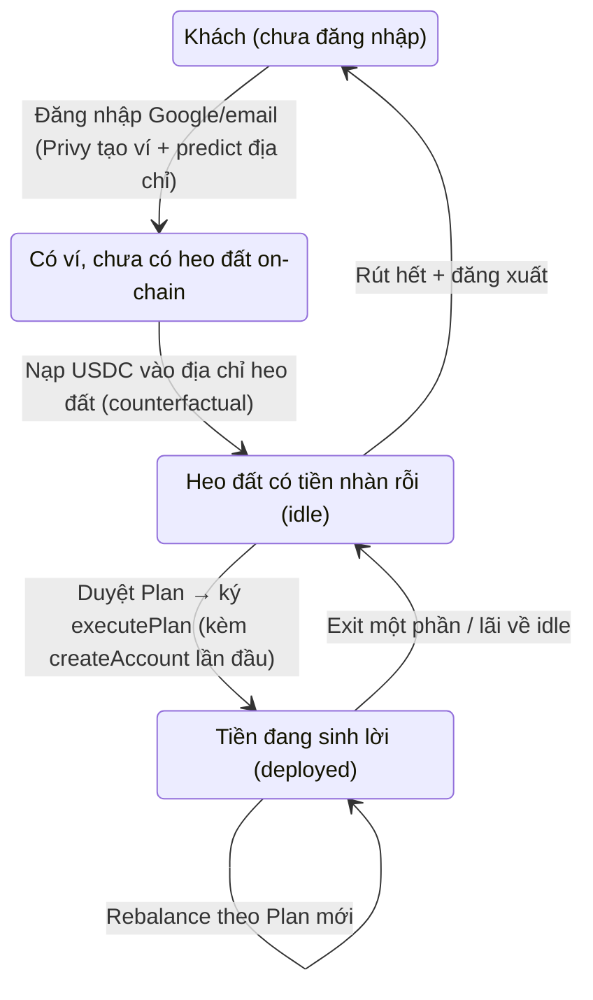
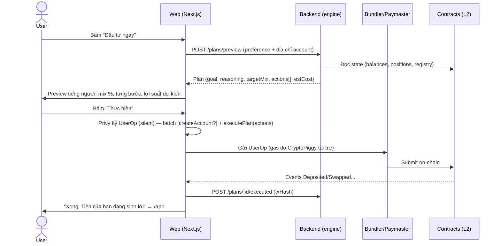

# CryptoPiggy Web — Product Flow

Blueprint cho webapp Next.js. Nguyên tắc xuyên suốt: **người dùng không cần biết crypto là gì** — không seed phrase, không gas, không popup hex. Non-custodial tuyệt đối: mọi lệnh di chuyển tiền do chính ví user ký (`onlyOwner` trên `SmartInvestmentAccount`).

## Stack quyết định

| Lớp | Lựa chọn | Ghi chú |
|---|---|---|
| Frontend | Next.js + TypeScript + wagmi/viem | viem đã được dùng trong `contracts/demo` |
| Ví | Privy embedded wallet (đăng nhập Google/email) | 2-of-3 Shamir shares, non-custodial |
| Gas | EIP-7702 smart EOA + paymaster (Pimlico/Alchemy) | User không bao giờ cần ETH; `msg.sender` vẫn là owner nên contract giữ nguyên |
| Chain | **Base** (dev trên Base Sepolia) | Ẩn hoàn toàn khỏi user — không có bước chọn chain/token; user chỉ nạp ETH native |
| Engine | Backend API trả Plan = `Action[]` | Chưa build — Phase 0 mock phía client như demo |

## Trạng thái người dùng (state machine)



Điểm kỹ thuật then chốt: địa chỉ heo đất được tính trước bằng `AccountFactory.predict(owner, salt)` (CREATE2). **User nạp tiền được trước khi account deploy** — token ERC-20 gửi vào địa chỉ counterfactual nằm chờ, deploy xong account sở hữu luôn. `createAccount` được batch chung với `executePlan` đầu tiên trong một UserOp 7702 (một lần ký, gas do ta tài trợ).

## Sơ đồ màn hình (routes)

```
/                     Landing — giá trị sản phẩm, "Bắt đầu tiết kiệm"
/app                  Dashboard (portfolio) — màn hình trung tâm
/app/deposit          Nạp tiền — địa chỉ + QR, trạng thái chờ nhận
/app/plan             Preference → Plan preview → Thực hiện
/app/withdraw         Rút tiền
/app/activity         Lịch sử giao dịch
/app/settings         Tài khoản, export key, recovery
```

Đăng nhập bằng Privy modal (không có trang /login riêng). Route `/app/*` guard bằng session.

## Flow 1 — Onboarding (mục tiêu: dưới 60 giây tới lúc thấy địa chỉ nạp)

1. Landing → **"Bắt đầu"** → Privy modal: Google / email OTP.
2. Ngầm phía sau, không hiện gì cho user:
   - Privy sinh embedded wallet (EOA), tách 3 shares.
   - Ký EIP-7702 authorization (chữ ký off-chain, một lần).
   - Gọi `factory.predict(ownerAddress, salt)` → địa chỉ heo đất.
   - `POST /auth/verify` với Privy token → backend tạo user record.
3. Màn chào: **"Heo đất của bạn đã sẵn sàng"** + địa chỉ + QR.
4. **Preference quiz** — 3 câu, ngôn ngữ đời thường:
   - Mục tiêu: tích lũy dài hạn / lãi ổn định / thử cho biết
   - Chịu biến động: không / một chút / thoải mái
   - Kỳ hạn dự kiến: <6 tháng / 6–24 tháng / >2 năm
   - → `PUT /me/preference`. Có nút "để sau" (mặc định hồ sơ an toàn nhất).
5. Đích: `/app/deposit`.

## Flow 2 — Nạp tiền

Đơn giản hóa tối đa: user chỉ nạp **ETH native trên Base** — không chọn chain, không chọn token. Mọi chuyển đổi sang tài sản sinh lời là việc của engine ở bước Plan.

1. Hiện địa chỉ heo đất + QR, kèm cảnh báo rõ: chỉ gửi ETH trên mạng Base.
2. FE poll `balanceOf(accountAddress)` (hoặc backend đẩy qua websocket sau này) → khi tiền vào: trạng thái **"Đã nhận X USDC 🎉"**.
3. Ngay khi có idle balance → CTA sang Flow 3: *"Cho tiền đi làm việc?"*.
4. Phase sau: tích hợp onramp (mua USDC bằng VND) — ngoài scope MVP.

## Flow 3 — Plan & Execute (vòng lặp cốt lõi)



Chi tiết màn **Plan preview** — đây chính là màn "xác nhận giao dịch", thay thế popup ví:
- Mục tiêu + lý do của engine, viết bằng ngôn ngữ thường ("Vì bạn chọn an toàn, 70% vào kênh lãi ổn định…").
- Target mix (biểu đồ) + bảng từng bước (mỗi `Action` dịch thành câu: "Gửi 400.000đ giá trị USDC vào Aave").
- Nút **Thực hiện** = ký. Không hiện calldata; có mục "chi tiết kỹ thuật" thu gọn cho ai muốn xem.
- Plan có TTL: nếu preview quá X phút → tự refetch trước khi ký (quote swap có thể cũ; `minOut` trong Action là chốt chặn on-chain).

## Flow 4 — Dashboard (portfolio)

- **Tổng giá trị** heo đất (headline) + biến động.
- Split ba bucket như demo: **Idle / Held / Earning** — mỗi holding gắn nhãn kênh (Aave, Vault…).
- Preference hiện tại + nút sửa (sửa xong gợi ý re-plan).
- Nudge thông minh: có idle ≥ ngưỡng → "Bạn có X USDC chưa sinh lời"; lệch target mix → gợi ý rebalance.
- Nguồn dữ liệu: đọc on-chain trực tiếp (viem multicall: `balanceOf`, `convertToAssets`, aave supplied) — không phụ thuộc backend để hiển thị tiền. Backend chỉ bổ sung APY/metadata.

## Flow 5 — Rút tiền

Một màn duy nhất: nhập **số tiền** + chọn đích (**ví heo đất → địa chỉ ngoài** hoặc chỉ về idle).

Phía sau, FE/engine tự dựng chuỗi và batch thành **một lần ký**:
1. Nếu idle không đủ → `Action[]` WITHDRAW từ positions (rút từ kênh lãi thấp nhất trước — engine quyết).
2. `withdraw(token, amount)` → về ví owner (embedded EOA).
3. Nếu đích là địa chỉ ngoài → ERC-20 `transfer` từ EOA (batch được trong cùng UserOp 7702).

Luôn hiển thị trước: tổng nhận được, các bước, cảnh báo nếu phải thoát vị thế sớm. `exit()` status-independent — kể cả protocol bị disable trong Registry thì rút vẫn chạy (bảo chứng thiết kế của contracts).

## Flow 6 — Lịch sử

- Nguồn 1 (on-chain, không cần backend): events `Deposited`, `Withdrawn`, `Swapped`, `WithdrawnToOwner` của account.
- Nguồn 2 (backend): plan history — mỗi lần execute lưu plan + lý do → user xem lại "tại sao hồi đó hệ thống đề xuất vậy".
- Mỗi dòng có link block explorer (mục "chi tiết kỹ thuật").

## Flow 7 — Settings

- Hồ sơ đăng nhập (email/Google), đăng xuất.
- **Xuất private key** (UI của Privy, app không chạm key) — bằng chứng self-custody, kèm giải thích.
- Thiết lập recovery (mật khẩu khôi phục / cloud backup) + cảnh báo "mất email = mất ví nếu không có recovery".
- Thông tin mạng/contract (cho user kỹ tính).

## Xử lý lỗi & edge cases

| Tình huống | Hành vi |
|---|---|
| Tx revert | Decode custom errors (`SwapFailed`, `InsufficientOutput`, `PositionNotActive`…) → thông điệp tiếng Việt + hành động gợi ý (thử lại / plan mới) |
| Plan cũ (giá đổi) | Refetch plan trước khi ký nếu quá TTL; `minOut` bảo vệ tầng cuối |
| Paymaster hết quota / từ chối | Thông báo "hệ thống đang bận, thử lại sau ít phút" + alert nội bộ |
| Nạp sai mạng / sai token | Cảnh báo đậm ở màn deposit; hướng dẫn recovery thủ công (docs) |
| User đóng tab giữa lúc pending | Trạng thái tx lưu backend + đọc lại từ chain khi quay lại |
| Backend chết | Dashboard + rút tiền vẫn chạy (đọc/ghi on-chain trực tiếp); chỉ planner tê liệt |

Nguyên tắc: **xem tiền và rút tiền không bao giờ được phụ thuộc backend** — đúng tinh thần non-custodial.

## API contract đề xuất cho backend (cần Vũ confirm)

```
POST /auth/verify            {privyToken} → session (JWT)
GET  /me/preference          → {goal, riskTolerance, horizon}
PUT  /me/preference          {goal, riskTolerance, horizon}
POST /plans/preview          {account, mode: deploy|rebalance|exit, amount?}
                             → {planId, goal, reasoning, targetMix[],
                                actions: Action[], estCost, expiresAt}
POST /plans/:id/executed     {txHash}
GET  /me/activity            → merged plan history
GET  /market/positions       → positions từ Registry + APY + tên hiển thị
```

`Action` giữ nguyên struct trong `contracts/src/Types.sol` (kind, positionId, assetIn/Out, router, amount, minOut, routeData) — backend trả đúng thứ FE đưa thẳng vào `executePlan`.

## Lộ trình build

- **Phase 0 — chạy trên Base Sepolia, không cần contracts (bây giờ):** scaffold Next.js; Privy thật; **địa chỉ heo đất = chính ví embedded** (khi factory deploy lên Base thì bật `NEXT_PUBLIC_FACTORY_ADDRESS` để chuyển sang `predict()` — code sẵn cả hai nhánh); nạp/rút ETH native là thật; planner **mock phía client**, execute ở chế độ mô phỏng. Không đụng vào repo contracts/backend.
- **Phase 1 — backend thật:** thay mock planner bằng API (contract ở trên); thêm session auth.
- **Phase 2 — testnet (Base Sepolia):** bật 7702 + Pimlico paymaster thật; deploy contracts lên testnet (việc của Vũ); test e2e flow gasless.
- **Phase 3 — polish & mainnet-gating:** onramp, notifications, audit contracts (điều kiện tiên quyết của Vũ trước mainnet).
